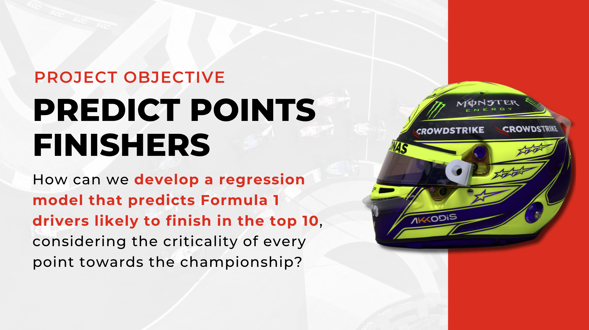

# **ON THE RIGHT TRACK!** PREDICTING F1 RACE POINT FINISHERS USING AN ENSEMBLE TREE MODEL REGRESSOR

Thanks to Netflix's Drive to Survive, Formula 1 (F1) has taken the world by storm! With sponsorships hitting a whopping $75 million a year and a betting market worth over $1 billion, there’s serious money on the line. And let’s not forget F1 fantasy leagues—part of a gaming industry projected to hit $87 billion by 2031.

To help everyone make the most of this excitement, **we’ve built a regression model that predicts which drivers are most likely to finish in the top ten.** It’s a game-changer because, in F1, every point matters.

For teams, it’s a way to fine-tune strategies and identify areas to improve. Bettors can make smarter, more informed decisions about where to place their bets. And for fantasy players? This tool is your secret weapon to build winning teams and nail those transfers. Whether you’re chasing trophies, cash, or just bragging rights, we’re here to give you the edge. Let’s race!

### HIGHLIGHTS 🌟
* **Data Collection:** The data was gathered from multiple sources, including the Ergast Developer API, which provides historical F1 records dating back to the 1950s world championship. This dataset includes details on circuits, constructors, drivers, lap times, race results, and statuses. Additional data was scraped from the F1 official website for practice session details and from Wikipedia for circuit lengths.
