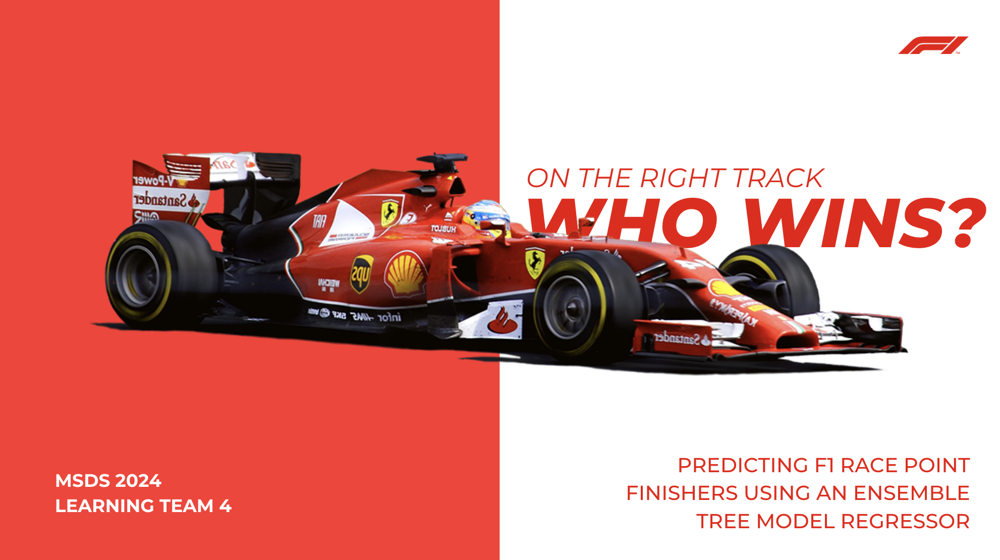

# **ON THE RIGHT TRACK!** PREDICTING F1 RACE POINT FINISHERS USING AN ENSEMBLE TREE MODEL REGRESSOR

Thanks to Netflix's Drive to Survive, Formula 1 (F1) has taken the world by storm! With sponsorships hitting a whopping $75 million a year and a betting market worth over $1 billion, there’s serious money on the line. And let’s not forget F1 fantasy leagues—part of a gaming industry projected to hit $87 billion by 2031.

To help everyone make the most of this excitement, **we’ve built a regression model that predicts which drivers are most likely to finish in the top ten.** It’s a game-changer because, in F1, every point matters.

For teams, it’s a way to fine-tune strategies and identify areas to improve. Bettors can make smarter, more informed decisions about where to place their bets. And for fantasy players? This tool is your secret weapon to build winning teams and nail those transfers. Whether you’re chasing trophies, cash, or just bragging rights, we’re here to give you the edge. Let’s race!

### HIGHLIGHTS 🌟
* **Data Collection:** The data was gathered from multiple sources, including the Ergast Developer API, which provides historical F1 records dating back to the 1950s world championship. This dataset includes details on circuits, constructors, drivers, lap times, race results, and statuses. Additional data was scraped from the F1 official website for practice session details and from Wikipedia for circuit lengths.
* **Data Pre-processing:** The training dataset focused on the 2022–2023 F1 seasons, reflecting rule changes that overhauled car designs. It included drivers active in the last four races of 2023 with at least 10 completed races and excluded races where drivers did not finish. Time-series features, including lag variables for the previous five races (e.g., positions, standings, and lap rankings), were engineered, excluding each driver’s first five races due to missing lag data.
* **Model Prediction Steps:** The prediction process treats each driver independently, creating separate datasets based on their unique race history. Lagged features reflect only the most recent completed races for each driver, accounting for missed events. For example, predicting Carlos Sainz’s 10th race uses data from races 3–7 if he missed races 8 and 9, while Lewis Hamilton’s prediction would use races 5–9 if he competed. Effectively, 20 individual models are developed, one per driver, with predictions made in a rolling fashion, incorporating actual results into the training set for subsequent races.
* **Model Selection:** Across various time-series splits with different train-test sizes, the Random Forest Regressor consistently achieved the highest MAP@K score of 89% among the tested models, including Linear Regression, Gradient Boosting, XGBoost, and a walk-forward baseline. MAP@K was selected as the evaluation metric because it is specifically designed for ranked data, unlike MAE, MSE, or NDCG, which are better suited for unranked or rated datasets.
* **Model Explainability:** Local Interpretable Model-Agnostic Explanations (LIME) was used to identify key features driving the model’s predictions by fitting a simple local model near the prediction. Diverse Counterfactual Explanations (DICE) generated feature changes that would lead to different prediction outcomes.
* **Actionable Driver Recommendations:** In a given race, Pierre Gasly was predicted to finish just above 10th, with a predicted position of 10.37. According to LIME, key factors influencing this prediction included his qualifying position, finishing position five races ago, cumulative constructor points, and his average lap and lap position in the previous race. Gasly's prediction outside the top ten was largely due to a weak qualifying performance, between 8th and 12th. To break into the top 10, DICE suggests Gasly aim for a 5th-place qualifying result in five races' time and target an average finishing position of 8th across the next five races, based on adjustments in the lag features for race results.

### KEY TAKEAWAYS 🔑
* DICE and LIME are powerful explainability tools that make model predictions more actionable. For this project, they helped the team identify key features influencing race results, enabling them to focus on areas for performance improvement. Beyond just understanding the factors behind predictions, these tools also provided clear targets for improving future race outcomes and qualifying performances, giving the team a data-driven roadmap for achieving better results.
* As highlighted by the feature importances from LIME, exogenous variables like qualifying position and cumulative points play a significant role in predicting race results. By using a traditional ML model, we can incorporate these additional variables into the prediction. Given this, it’s worth exploring the use of ARIMAX for making predictions, as it allows for the inclusion of such external factors.
